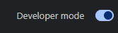
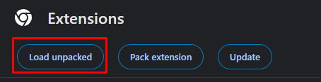
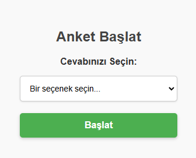

# ubys anket çözücü
## öncelikler bu zip'i indirip klasöre çıkartın
[ZIP Dosyasını İndir](https://raw.githubusercontent.com/ssevban/ubysAnket/main/ubysanket.zip)

---
chromeda uzantıların ayarlarına gitmemiz gerekiyor.

[**chrome://extensions**](chrome://extensions)

burada sağ üstte bulunan geliştirici modunu aktif etmemiz gerekiyor. 

daha sonra sol üstte çıkan **paketlenmemiş ögeleri yükle**'ye tıklayın.

zipten çıkardığınız klasörü yükleyin.
daha sonra anket sayfasına gelin

*eğer sayfa önceden açıksa sayfayı yenileyin*

uzantılar simgesinden uzantıya tıklayın. şöyle bir ekran çıkacak 

buradan seçeneğinizi seçip başlata tıklayın.
